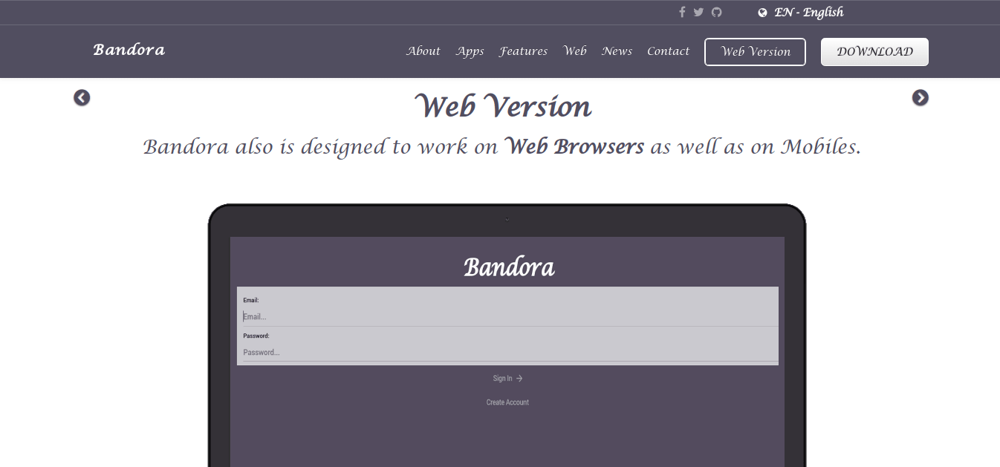
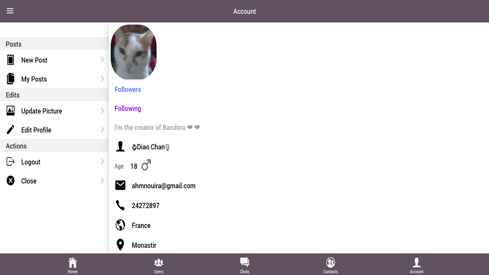

<b><a href="https://bandora.web.app/">LIVE APP</a> :point_right:</b>

<b><a href="https://bit.ly/2S3PfyT">DOWNLOAD APP</a> :point_right:</b>

    

<!-- 
    
    -->

 

> Bandora is a social media chat mobile :iphone: and web :computer: application that lets you chat & meet new people around the world :globe_with_meridians:. 
The Bandora mobile apps are now available worldwide. Chatting with people with your mobile device :100:.
---

:link: https://bandora.now.sh/

       

</img>

### Features

- Meet People :couple:
- Chats :envelope:
- Share Posts :postbox:
- & More... 

### How to get started using Bandora ?

- Download the App :point_right: [link](https://bit.ly/2S3PfyT)
- Create an account
- Chat with people
- Enjoy :v:

### Supported platforms

- [Android](https://bit.ly/2S3PfyT) 
- [Web Browser](https://bandora.web.app/) 

 
 
 
 

## Important Notice

Please make sure that you always read the tagged README for **news** about Bandora. 

__News__

- View photos in full screen
- Add a new page to manage user's posts

## Features

Bandora let you **meet new people**, **chats**, **follow users**, **edit account**, **posts messages** & more...

    
    &nbsp;&nbsp;&nbsp;&nbsp;
    
    &nbsp;&nbsp;&nbsp;&nbsp;
    

## Web Version

Bandora also is designed to work on Web Browsers :computer: as well as on Mobiles :iphone:.

       

    
    &nbsp;&nbsp;
    

## Contributing

1. Fork it
2. Create your feature branch (`git checkout -b my-new-feature`)
3. Commit your changes (`git commit -am 'Add some feature'`)
4. Push to the branch (`git push origin my-new-feature`)
5. Create new Pull Request

## License

Bandora is released under the [MIT][mit_license].

Made with :sparkling_heart: from Monastir, Tunisia :tunisia:

:copyright: 2020 [ahmnouira][ahmnouira]

[mit_license]: http://opensource.org/licenses/MIT
[ahmnouira]: http://github.com/ahmnouira